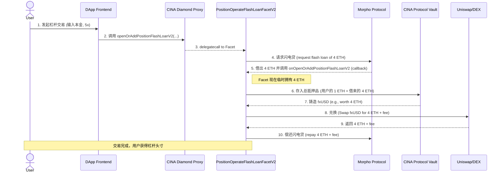

# CINA DOLLAR (ETH Shanghai 2025) - 技术架构文档

## 1. 概述

`CINA DOLLAR` 项目的技术核心是在 CINA 协议（一个 f(x) Protocol 的分叉）的基础上，集成 Morpho 协议的闪电贷功能，以实现高资本效率的杠杆交易。

其合约部分建立在 `CINA-protocol-contracts` 的钻石标准（EIP-2535）架构之上，通过一个新增的“切面”合约 `PositionOperateFlashLoanFacetV2.sol` 来实现核心功能。

## 2. 技术栈

*   **智能合约:**
    *   **框架:** Hardhat, Foundry
    *   **语言:** Solidity
    *   **核心架构:** Diamond Standard (EIP-2535)
    *   **外部协议集成:** Morpho Protocol, Uniswap (或其他 DEX)
*   **前端:**
    *   **框架:** Next.js, React
    *   **语言:** TypeScript
    *   **区块链交互:** Wagmi, Ethers.js

## 3. 核心合约与架构

### 3.1. 与 CINA 核心协议的关系

*   本项目**复用**了 `CINA-protocol-contracts` 的绝大部分核心组件，包括 `PoolManager`、资金池（Pools）、`TickLogic` 等。
*   其创新之处在于**新增**了一个功能切面（Facet）—— `PositionOperateFlashLoanFacetV2.sol`，并将其注册到 CINA 协议的钻石代理合约中。
*   这种架构充分利用了钻石标准的可扩展性，在不改变核心协议代码的情况下，为其“增添”了全新的功能。

### 3.2. `PositionOperateFlashLoanFacetV2.sol` - 功能核心

这个“切面”合约是整个黑客松项目的技术实现核心。

#### **原子化交易序列图**

以下是 `openOrAddPositionFlashLoanV2` 函数被调用后的详细执行流程：

#### **关键函数解析**

*   **`openOrAddPositionFlashLoanV2(bytes calldata params)`:**
    *   这是用户调用的入口函数。
    *   它负责解析来自前端的参数（如杠杆倍数、用户本金、目标资产等）。
    *   其核心工作是向 Morpho 协议发起一次闪电贷请求，并指定 `onOpenOrAddPositionFlashLoanV2` 作为闪电贷的回调函数。

*   **`onOpenOrAddPositionFlashLoanV2(bytes calldata data, bytes calldata)`:**
    *   这是一个符合 Morpho `IFlashLoanCallback` 接口的回调函数。
    *   **它不是由用户调用的**，而是在 Morpho 成功借出资金后，由 Morpho 合约在**同一笔交易内**自动调用的。
    *   `data` 参数包含了在第一步函数中编码的所有上下文信息（用户地址、目标头寸等）。
    *   这个函数是所有核心操作的执行场所：
        1.  接收并验证来自 Morpho 的资金。
        2.  调用 CINA 核心协议（`PoolManager`）来存入总抵押品并铸造稳定币。
        3.  调用 DEX 合约来执行兑换操作。
        4.  调用 Morpho 合约来偿还贷款。
    *   整个函数必须在闪电贷的同一个交易区块内完成，否则交易会失败。

## 4. 前端 (`frontend`)

*   前端是一个标准的 Next.js 应用。
*   其核心页面允许用户输入杠杆参数，并构建 `openOrAddPositionFlashLoanV2` 函数所需的 `params` 字节码。
*   它使用 Wagmi/Ethers.js 来连接用户钱包，并向 CINA 协议的钻石代理合约地址发送最终的交易请求。

## 5. 总结

`CINA DOLLAR` 项目在技术上是一个教科书级别的 DeFi 可组合性范例。它通过一个模块化的“切面”合约，无缝地将一个外部协议（Morpho）的功能集成到自身的核心业务流程中，从而创造出了一个全新的、高资本效率的金融产品，充分展示了其底层钻石标准架构的灵活性和强大潜力。
