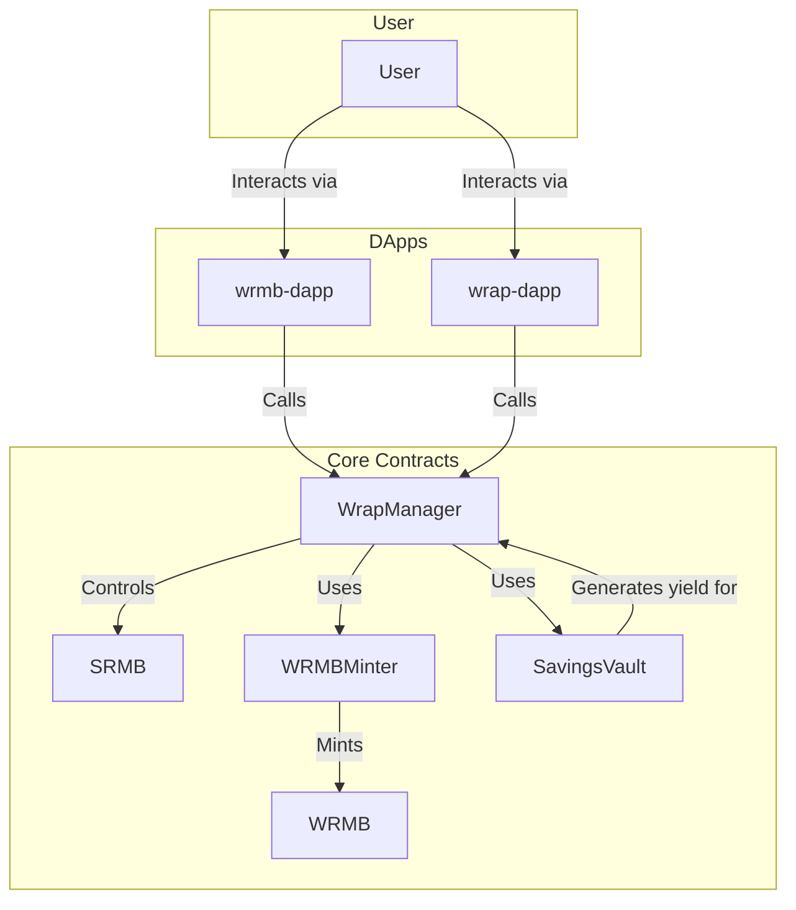

# WRMB 协议 - 技术架构文档

## 1. 概述

WRMB 协议是一套基于 Solidity 的智能合约系统，其核心是实现了一个价值累积的储蓄和收益机制。其架构设计的关键是将代币的**流动性 (`WRMB`)** 与**储蓄凭证 (`sRMB`)** 分离，并通过一个中央协调合约 (`WrapManager`) 和一个收益引擎 (`SavingsVault`) 来驱动整个系统。

## 2. 核心合约 (`WRMB-protocol-contracts`)

所有核心业务逻辑都定义在 `WRMB-protocol-contracts` 仓库中。

### 2.1. `WRMB.sol`

*   **类型:** 标准 ERC20 代币。
*   **角色:** 协议的流动性代币，可在二级市场自由交易。
*   **关键逻辑:** 包含一个 `mint` 函数，但该函数被设置为 `onlyMinter`，意味着只有指定的 `WRMBMinter` 合约地址才能铸造新的 `WRMB` 代币。这控制了代币的通胀来源。

### 2.2. `SRMB.sol`

*   **类型:** 受限制的 ERC20 代币。
*   **角色:** 参与储蓄系统的“入场券”。
*   **关键逻辑:**
    *   其 `_beforeTokenTransfer` (或类似的 hook) 被重写，以实现 `_restrictedTransfer` 逻辑。
    *   该逻辑只允许 `wrapContract` 地址（即 `WrapManager`）转移 `sRMB`。
    *   这意味着用户之间不能相互转让 `sRMB`，他们只能通过与 `WrapManager` 合约交互来获得或消费 `sRMB`。

### 2.3. `WrapManager.sol`

*   **角色:** **核心协调合约**，是大多数用户交互的直接入口。
*   **关键逻辑:**
    *   **`wrap(uint256 amount)`:**
        1.  接收用户的 `WRMB` 代币。
        2.  调用 `WRMBMinter` 的 `mintOnWrap` 函数，该函数内部会调用 `SRMB.mint()` 为用户铸造等量的 `sRMB`。
    *   **`unwrap(uint256 amount)`:**
        1.  销毁用户的 `sRMB` 代币。
        2.  将等量的 `WRMB` 代币转回给用户。
    *   **`deposit(uint256 amount)`:** (与 Savings 功能相关)
        1.  接收用户的 `sRMB`。
        2.  将 `sRMB` 转给 `SavingsVault`。
        3.  `SavingsVault` 根据其内部价值计算，为用户记上对应数量的 `sWRMB` 份额。
    *   **`withdraw(uint256 shareAmount)`:** (与 Savings 功能相关)
        1.  通知 `SavingsVault` 销毁用户的 `sWRMB` 份额。
        2.  `SavingsVault` 计算出这些份额当前价值多少 `sRMB`，并授权 `WRMBMinter` 铸造这部分 `sRMB`。
        3.  `WRMBMinter` 的 `mintOnIncrease` 函数被调用，为用户铸造新的 `sRMB`。

### 2.4. `WRMBMinter.sol`

*   **角色:** `WRMB` 和 `sRMB` 代币的唯一铸造者（Minter），是协议的货币政策中心。
*   **关键逻辑:**
    *   它定义了代币（主要是 `sRMB`）通胀的唯一来源。
    *   **`mintOnWrap`:** 在用户执行 `wrap` 操作时被 `WrapManager` 调用，用于 1:1 铸造 `sRMB`。
    *   **`mintOnIncrease`:** 在用户从 `SavingsVault` 提取收益时被调用，用于铸造因收益而增发的 `sRMB`。
    *   **无 Rebase:** 该合约的逻辑明确表明，代币的增发是基于用户行为（`wrap` 和 `withdraw`）的，**不存在**自动变基（Rebase）机制。

### 2.5. `SavingsVault.sol`

*   **角色:** 协议的收益引擎和国库。
*   **关键逻辑:**
    *   **资产管理:** 负责管理所有用户存入的资金。
    *   **策略执行:** 它持有的资金会被用于执行各种投资策略以产生收益，例如，将其提供给 `v4-pool-amo` 模块进行做市。
    *   **价值记账:** 负责计算 `sWRMB` 份额的净值（NAV）。当收益产生时，`sWRMB` 的净值会增长。

## 3. 前端应用

### 3.1. `wrmb-dapp`

*   **定位:** 全功能主应用。
*   **技术栈:** Vue.js (推测，与生态系统其他 DApp 一致)。
*   **功能页面与合约交互:**
    *   **`Wrap.vue`:** 与 `WrapManager` 的 `wrap` 和 `unwrap` 函数交互。
    *   **`Savings.vue`:** 与 `WrapManager` 的 `deposit` 和 `withdraw` 函数交互，并从 `SavingsVault` 读取 `sWRMB` 净值等数据用于展示。
    *   **`Bonds.vue`:** 与协议的债券合约（未在本次分析的核心合约中）进行交互。

### 3.2. `wrap-dapp`

*   **定位:** 轻量级、单一功能工具。
*   **技术栈:** Vue.js (推测)。
*   **功能页面与合约交互:**
    *   其唯一的页面 `Home.vue` 只与 `WrapManager` 的 `wrap` 和 `unwrap` 函数交互，提供一个专注、无干扰的兑换体验。
