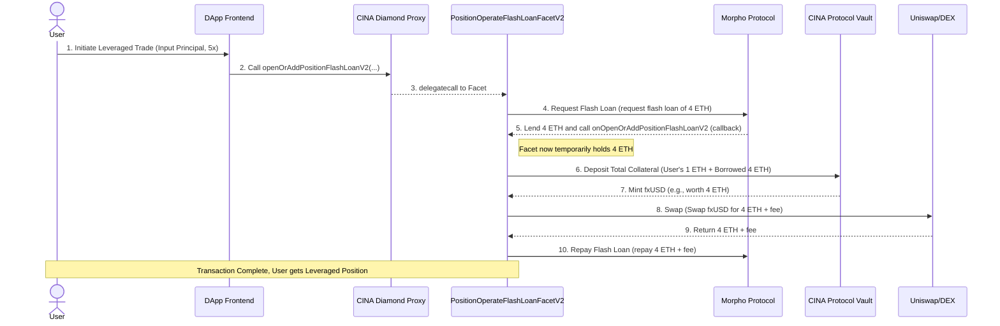

# CINA DOLLAR (ETH Shanghai 2025) - Technical Architecture Document

## 1. Overview

The technical core of the `CINA DOLLAR` project is to integrate the Flash Loan function of the Morpho Protocol on top of the CINA Protocol (a fork of f(x) Protocol) to achieve high capital efficiency leveraged trading.

Its contract part is built on the Diamond Standard (EIP-2535) architecture of `CINA-protocol-contracts`, implementing core functions through a newly added "Facet" contract `PositionOperateFlashLoanFacetV2.sol`.

## 2. Tech Stack

*   **Smart Contracts:**
    *   **Frameworks:** Hardhat, Foundry
    *   **Language:** Solidity
    *   **Core Architecture:** Diamond Standard (EIP-2535)
    *   **External Protocol Integration:** Morpho Protocol, Uniswap (or other DEX)
*   **Frontend:**
    *   **Frameworks:** Next.js, React
    *   **Language:** TypeScript
    *   **Blockchain Interaction:** Wagmi, Ethers.js

## 3. Core Contracts & Architecture

### 3.1. Relationship with CINA Core Protocol

*   This project **reuses** most core components of `CINA-protocol-contracts`, including `PoolManager`, Pools, `TickLogic`, etc.
*   Its innovation lies in **adding** a functional Facet — `PositionOperateFlashLoanFacetV2.sol`, and registering it to the CINA Protocol's Diamond Proxy contract.
*   This architecture fully utilizes the extensibility of the Diamond Standard, "adding" brand new functions to the core protocol without changing its code.

### 3.2. `PositionOperateFlashLoanFacetV2.sol` - Functional Core

This "Facet" contract is the technical implementation core of the entire hackathon project.

#### **Atomic Transaction Sequence Diagram**

The following is the detailed execution flow after the `openOrAddPositionFlashLoanV2` function is called:

#### **Key Function Analysis**

*   **`openOrAddPositionFlashLoanV2(bytes calldata params)`:**
    *   This is the entry function called by the user.
    *   It is responsible for parsing parameters from the frontend (such as leverage multiple, user principal, target asset, etc.).
    *   Its core work is to initiate a flash loan request to the Morpho Protocol and specify `onOpenOrAddPositionFlashLoanV2` as the flash loan callback function.

*   **`onOpenOrAddPositionFlashLoanV2(bytes calldata data, bytes calldata)`:**
    *   This is a callback function conforming to the Morpho `IFlashLoanCallback` interface.
    *   **It is not called by the user**, but is automatically called by the Morpho contract within the **same transaction** after Morpho successfully lends the funds.
    *   The `data` parameter contains all context information encoded in the first step function (user address, target position, etc.).
    *   This function is the execution place for all core operations:
        1.  Receive and verify funds from Morpho.
        2.  Call CINA Core Protocol (`PoolManager`) to deposit total collateral and mint stablecoins.
        3.  Call DEX contract to execute swap operations.
        4.  Call Morpho contract to repay the loan.
    *   The entire function must be completed within the same transaction block of the flash loan, otherwise the transaction will fail.

## 4. Frontend (`frontend`)

*   The frontend is a standard Next.js application.
*   Its core page allows users to input leverage parameters and construct the `params` bytecode required for the `openOrAddPositionFlashLoanV2` function.
*   It uses Wagmi/Ethers.js to connect the user wallet and send the final transaction request to the CINA Protocol's Diamond Proxy contract address.

## 5. Summary

The `CINA DOLLAR` project is a textbook example of DeFi composability technically. It seamlessly integrates the function of an external protocol (Morpho) into its own core business process through a modular "Facet" contract, thereby creating a brand new, high capital efficiency financial product, fully demonstrating the flexibility and powerful potential of its underlying Diamond Standard architecture.
