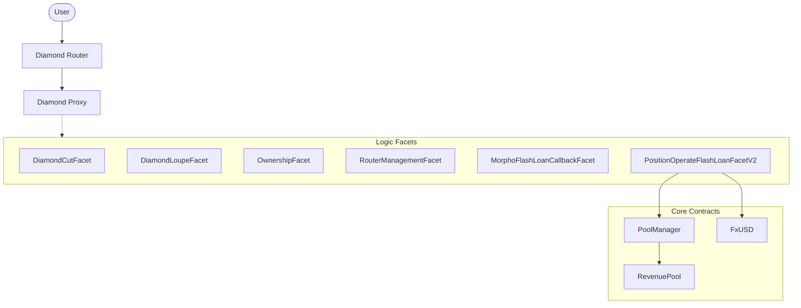

# CINA Protocol V2: Technical Architecture

## 1. Overview
CINA Protocol V2 is built upon the **EIP-2535 Diamond Standard**, providing a modular and upgradable framework for decentralized stablecoin operations. This architecture allows the protocol to surpass the 24KB contract size limit and facilitates seamless feature upgrades.

## 2. Diamond Architecture
The core of the protocol is the `Diamond` contract, which acts as a proxy to various "Facets" (logic implementations).

### 2.1 Core Components
- **Diamond Proxy**: The main entry point that delegates calls to facets.
- **Facets**: Discrete units of logic (e.g., `PositionOperateFlashLoanFacetV2` for leveraging operations).
- **PoolManager**: Manages the collateral pools and debt logic.
- **FxUSD**: The native stablecoin of the protocol.

## 3. Position Management
The V2 protocol introduces advanced position management techniques, primarily focusing on capital efficiency through flash loans.

### 3.1 Flash Open Position Flow
1. **Borrow**: Flash borrow collateral/debt tokens via Morpho Blue.
2. **Execute**: Use the borrowed capital to mint fxUSD or swap between assets.
3. **Repay**: Return the flash loan within the same transaction using the newly created position's assets.

## 4. Key Contracts & Files
- `contracts/core/PoolManager.sol`: Central accounting and pool logic.
- `contracts/periphery/Diamond.sol`: The EIP-2535 proxy implementation.
- `contracts/common/EIP2535/`: Implementation of the Diamond standard facets.
- `contracts/periphery/facets/PositionOperateFlashLoanFacetV2.sol`: Logic for flash-enabled position operations.

## 5. Deployment Structure
The deployment is split into:
1. **Core Protocol**: Base stablecoin logic.
2. **Diamond Router**: Periphery contracts for advanced trading features.
