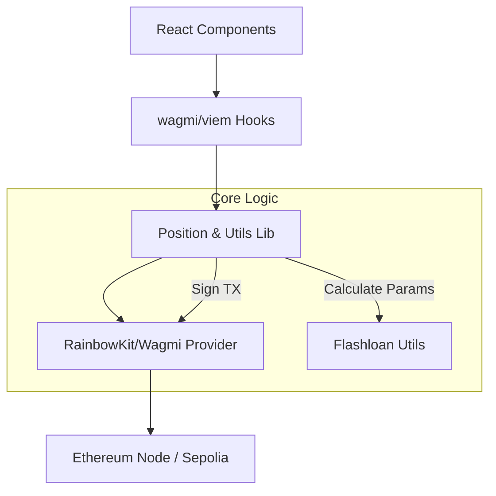

# CINA Trade: Technical Architecture

## 1. Tech Stack
CINA Trade is built with a modern frontend stack ensuring speed, security, and developer efficiency:
- **Framework**: [Next.js](https://nextjs.org/) (React)
- **Styling**: [Tailwind CSS](https://tailwindcss.com/)
- **Web3 Libraries**: [wagmi](https://wagmi.sh/) & [viem](https://viem.sh/)
- **Wallet UI**: [RainbowKit](https://www.rainbowkit.com/)
- **State Management**: React Context & Hooks

## 2. Core Logic Implementation
The application logic is centered around efficient contract interaction and robust parameter calculation for flash loan operations.

### 2.1 Position Management (`src/lib/position.ts`)
Handles the high-level orchestration of opening and closing positions. It interacts with the `DiamondRouter` facets:
- `openPositionFlashLoan`: Prepares and sends the transaction for flash-enabled opening.
- `closePositionFlashLoan`: Manages the atomic exit of a leveraged position.

### 2.2 Flash Loan Utilities (`src/lib/flashloan-utils.ts`)
Contains the mathematical logic for leverage operations:
- **Borrow Calculation**: `collateralAmount * (leverage - 1)`.
- **Hook Data Encoding**: Encodes the complex bytes data required by the `DiamondRouter` callback.
- **Slippage Enforcement**: Calculates `minOut` based on user-defined tolerance.

## 3. Architecture Diagram

## 4. Integration with CINA Protocol
CINA Trade acts as a primary frontend for the `CINA-protocol`. It specifically targets the **Diamond Router** implemented in V2, utilizing its modular facets to provide "one-transaction" leverage experiences.

## 5. Deployment & Testing
- **Development**: `npm run dev`
- **Build**: `npm run build`
- **Testing**: Managed via [Vitest](https://vitest.dev/) for utility functions and logic validation.
