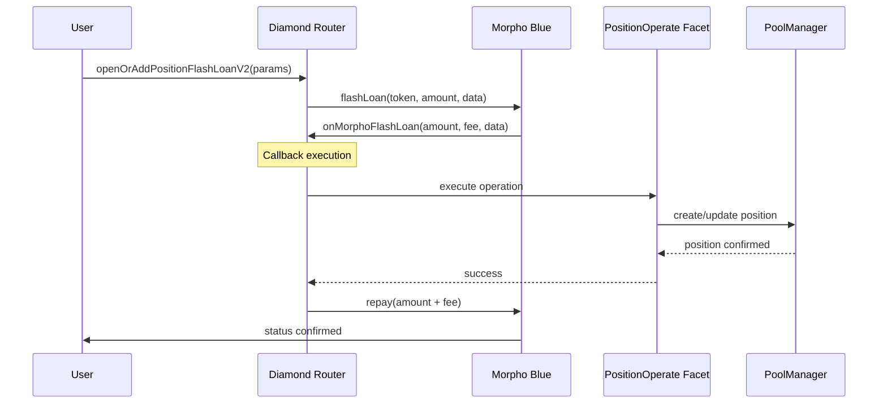

# Flash Open Position: Technical Guide

## 1. Introduction
The Flash Open Position mechanism allows users to open leveraged positions in a single transaction by utilizing flash loans. In CINA Protocol V2, this is implemented using **Morpho Blue** flash loans integrated via the Diamond Router.

## 2. Mechanism Overview
The core idea is to borrow the required capital upfront, establish the position, and then use the minted `fxUSD` or collateral to satisfy the flash loan repayment requirement.

### 2.1 Workflow


## 3. Integration Details
### 3.1 Contract Methods
The primary entry point is `openOrAddPositionFlashLoanV2` on the `DiamondRouter`.

```solidity
function openOrAddPositionFlashLoanV2(
    ConvertInParams calldata convertInParams,
    address pool,
    uint256 positionId,
    uint256 borrowAmount,
    bytes calldata hookData
) external payable returns (uint256 newPositionId);
```

### 3.2 Key Parameters
- `convertInParams`: Information about the initial collateral deposit and any DEX swaps required.
- `borrowAmount`: The amount to borrow via flash loan to achieve the target leverage.
- `hookData`: Encoded risk parameters and callback instructions.

## 4. Integration Examples (TypeScript/viem)
Users can interact with this feature using the following pattern:

```typescript
const tx = await writeContract(config, {
  address: DIAMOND_ROUTER_ADDRESS,
  abi: POSITION_FACET_ABI,
  functionName: 'openOrAddPositionFlashLoanV2',
  args: [
    convertInParams, // Collateral & Swap info
    POOL_ADDRESS,    // Target FxPool
    0n,              // 0 for new position
    borrowAmount,    // Calculated flash loan amount
    hookData         // Encoded callback data
  ],
});
```

## 5. Security & Risk Management
- **Slippage Protection**: `ConvertInParams` includes `minOut` to protect against DEX price fluctuations.
- **Max Debt Ratio**: The `hookData` enforces a maximum debt ratio to prevent immediate liquidation.
- **Atomic Execution**: Since it uses flash loans, the entire operation is atomic; if any step fails, the transaction reverts, and no funds are lost (except gas).
