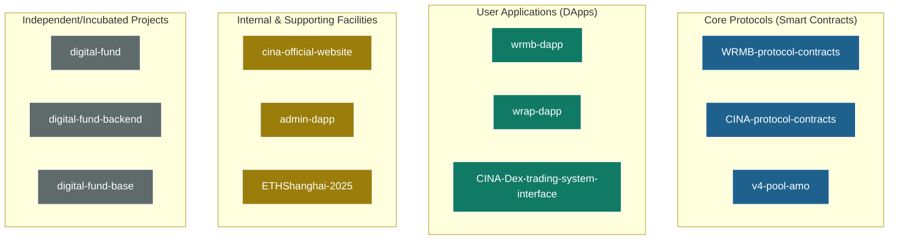
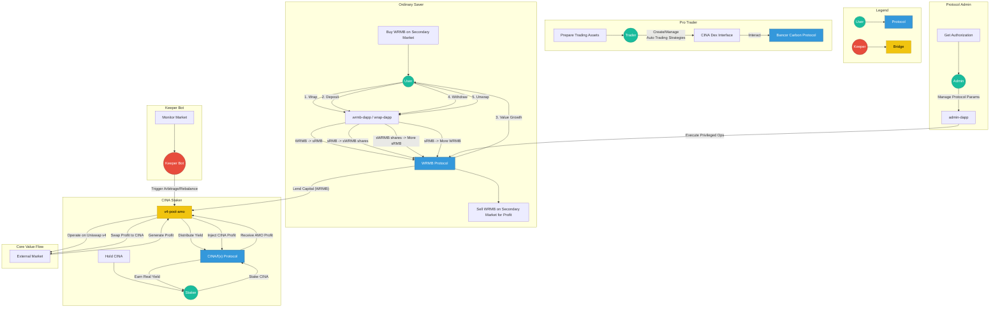

# CINA Ecosystem Ultimate Product Manual

## 1. Macro Vision: The Trinity of DeFi Lego

The CINA ecosystem is not a single protocol, but a complex DeFi ecosystem composed of three independent protocols, multiple DApps, and infrastructure that are composable with each other. The core idea of its design is to build a "Value Flywheel" that can reinforce itself, capture value, and feed back into the ecosystem through the specialized division of labor and collaboration of different protocols.

**Three Core Protocols:**

1.  **WRMB Savings & Yield Protocol:** The ecosystem's **Capital & Yield Layer**. Responsible for pooling user funds and generating real yield through investment strategies.
2.  **CINA/f(x) Stablecoin Protocol:** The ecosystem's **Governance & Asset Layer**. Responsible for issuing stablecoin assets (`fxUSD`) and using its governance token `CINA` as the ultimate value capturer of the ecosystem.
3.  **Bancor Carbon Trading Protocol:** The ecosystem's **Pro Trading Layer**. Responsible for providing advanced, automated on-chain trading strategy functions to attract professional traders.

## 2. Project Structure Panorama

The CINA ecosystem consists of 12 code repositories, each playing a different role:

## 3. Multi-Role User Interaction Panorama Flowchart

The diagram below depicts the complete interaction paths and value flow of major participants in the ecosystem.

## 4. Deep Dive into Protocol Products

### 4.1. WRMB Savings & Yield Protocol

*   **One-Liner:** The ecosystem's "Savings Bank", providing users with safe, sustainable real yield through a unique token mechanism.
*   **Core Gameplay:**
    1.  **Entry:** Users "wrap" freely circulating `WRMB` from the market into non-transferable `sRMB` 1:1 via the official DApp (`wrmb-dapp` or `wrap-dapp`).
    2.  **Savings:** Deposit `sRMB` into the protocol's "Vault" (`SavingsVault`) in exchange for vault share tokens `sWRMB`.
    3.  **Appreciation:** `SavingsVault` invests funds (e.g., lending to `v4-pool-amo`), and the generated profit constantly increases the Net Asset Value (NAV) of `sWRMB` shares.
    4.  **Harvest:** Users redeem appreciated `sWRMB` shares to receive **more** `sRMB` than originally deposited.
    5.  **Exit:** "Unwrap" `sRMB` 1:1 back to `WRMB` to sell on the secondary market, realizing final profit.
*   **Related Apps:**
    *   `wrmb-dapp`: Full-featured main app, providing savings, bonds, wrapping, etc.
    *   `wrap-dapp`: Lightweight tool, providing only wrap/unwrap functions.
    *   `admin-dapp`: Admin dashboard for managing interest rates, investment strategies, etc.

### 4.2. CINA/f(x) Stablecoin Protocol

*   **One-Liner:** The ecosystem's "Central Bank" and "Governance Council", responsible for issuing core assets and capturing ecosystem value.
*   **Core Products:**
    *   **`fxUSD` Stablecoin:** Based on the advanced architecture of f(x) Protocol, minted by over-collateralizing various assets (including RWA), with stability guaranteed by complex mechanisms like `PegKeeper`.
    *   **`CINA` Governance Token:** Holders and stakers of CINA tokens are the ultimate owners of the ecosystem. Various profits in the ecosystem (especially from `v4-pool-amo`) will eventually converge here and be distributed to CINA stakers as real yield.
*   **Related Apps:**
    *   `ETHShanghai-2025`: A functional demo showing how to use this protocol and flash loans to achieve complex leveraged trading, proving its powerful composability.

### 4.3. Bancor Carbon Trading Protocol (via `CINA-Dex-trading-system-interface`)

*   **One-Liner:** The ecosystem's "Pro Trading Terminal", serving advanced trading users.
*   **Core Gameplay:** It is not a simple token swap platform, but allows users to create **on-chain automated trading strategies**.
    *   **Range Strategy:** Users can set a buy price range and a sell price range (e.g., buy ETH at $1800-$1900, sell ETH at $2500-$2600).
    *   **Recurring Strategy:** Strategies can execute automatically in loops, where funds from selling automatically become ammo for buying, achieving continuous "buy low, sell high".
*   **Ecosystem Role:** Although the underlying layer is the Bancor Carbon Protocol, CINA packages and promotes it as part of its own ecosystem to attract and retain professional trading users, enriching ecosystem diversity.

## 5. Summary: A Sophisticated Value Loop

The product design of the CINA ecosystem demonstrates a very high standard. It does not simply pile up functions, but through the key value bridge of `v4-pool-amo`, it ingeniously transforms the **capital accumulation capability of the WRMB Protocol** into **value support and real yield source for the CINA Protocol**, forming a sustainable, positive economic flywheel. Meanwhile, by introducing the Carbon trading platform, it further expands its user profile and ecosystem boundaries.
