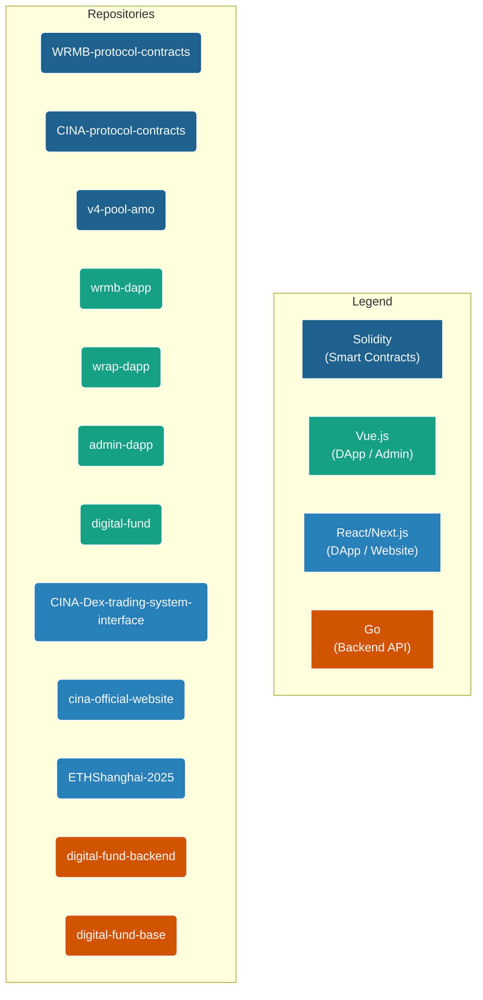

# CINA Ecosystem Unified Technical Document

## 1. Macro Technical Architecture: Microservice-Style Multi-Repository Cluster

Technically, the CINA ecosystem follows the core philosophies of "Microservices" and "Separation of Concerns", consisting of a project cluster containing 12 independent code repositories. Each repository has clear responsibilities and the most suitable technology stack for its scenario, communicating with each other through clearly defined on-chain smart contract interfaces and off-chain APIs.

Although this architectural pattern may seem complex at first glance, it brings extremely high **modularity, maintainability, and flexibility in technology selection**.

## 2. Project Code Structure Diagram

The diagram below intuitively shows all code repositories under the project root directory and their core technical positioning.

## 3. Tech Stack Details & Selection Analysis

### 3.1. Smart Contract Layer

*   **Language:** Solidity (`^0.8.x`)
*   **Core Frameworks:**
    *   **Foundry & Hardhat (Hybrid):** This is the standard mode for contract development across the project.
        *   **Foundry:** Used for core modules requiring high-intensity mathematical calculation and logic verification, such as `v4-pool-amo`, due to its superior performance and powerful fuzzing capabilities.
        *   **Hardhat:** Used for large, complex protocol bodies like `CINA-protocol-contracts` and `WRMB-protocol-contracts` due to its mature plugin ecosystem, powerful scripting capabilities, and good integration with frontend toolchains (like TypeChain).
*   **Key Design Patterns:**
    *   **Upgradeability (UUPS):** Core business contracts like `v4-pool-amo` all adopt the UUPS upgradeable proxy pattern to ensure logic can be iterated safely and at low cost in the future.
    *   **Modularity (EIP-2535 Diamond Standard):** `CINA-protocol-contracts` adopts the Diamond Standard, decoupling different protocol functions (such as position management, flash loans) into independent "Facet" contracts, achieving extremely high modularity and extensibility. This is the technical basis for `ETHShanghai-2025` to seamlessly integrate flash loan functions as a new Facet.
    *   **Access Control:** Widely uses OpenZeppelin's `Ownable` or `AccessControl` patterns to strictly manage permissions for privileged functions (such as modifying rates, pausing contracts).

### 3.2. Frontend Application Layer

Frontend technology selection shows a clear characteristic of "Suitability":

*   **Vue.js 3 Ecosystem:**
    *   **Tech Stack:** Vue 3 (Composition API), Vite, Vue Router, Pinia, Ethers.js.
    *   **Scenarios:** Mainly used for **internal management tools** and **functionally focused DApps**, such as `admin-dapp`, `wrmb-dapp`, `digital-fund`.
    *   **Reason:** Vue 3 offers a smooth development experience and lower cognitive load. Combined with Pinia for state management, it is very intuitive. For admin dashboards and utility DApps with clear functions and interaction paths, this is an excellent choice for rapid development and stable delivery.

*   **React/Next.js Ecosystem:**
    *   **Tech Stack:** React 18, Next.js (App Router), TanStack (Router/Query), Wagmi.
    *   **Scenarios:** Used for **public-facing websites** and **extremely complex professional DApps**, such as `cina-official-website` and `CINA-Dex-trading-system-interface`.
    *   **Reason:**
        *   **SEO & Performance:** Next.js's Static Site Generation (SSG) and Server-Side Rendering (SSR) capabilities are the best choice for the official website (`cina-official-website`).
        *   **Complex State Management:** For professional applications like `CINA-Dex-trading-system-interface` with complex forms, real-time data synchronization, and massive async requests, TanStack Query (React Query) in the React ecosystem provides unparalleled server-state management capabilities.
        *   **Web3 Hooks:** Wagmi provides complete and reliable React Hooks, greatly simplifying interaction with the blockchain, and is currently the best practice for React Web3 development.

### 3.3. Backend Service Layer

*   **Tech Stack:** Go, Gin (Web Framework), GORM (ORM), MySQL.
*   **Scenarios:** Used to handle businesses requiring off-chain database support, such as `digital-fund-backend` (NFT Market API).
*   **Architecture Patterns:**
    *   **Layered Architecture:** Adopts the classic `api` -> `service` -> `dao` (Data Access Object) layered design, achieving high decoupling of logic and data.
    *   **Shared Base Library:** Shares database models, utility functions, and common configurations through the `digital-fund-base` repository, improving code reuse and consistency.

## 4. Summary: Modern, Modular, Pragmatic

The overall technical architecture of the CINA ecosystem is a model of modernity, modularity, and pragmatism. It does not stick to a specific technology stack but chooses the optimal solution for the current scenario for each different component in the ecosystem.

*   **Contract Layer** embraces the latest industry standards, ensuring security, efficiency, and scalability.
*   **Frontend Layer** makes wise choices between the two mainstream ecosystems of Vue and React based on application target users and complexity.
*   **Inter-protocol Interaction** centers on on-chain interfaces, which are clear, transparent, and maximize trustlessness.

This pragmatic, future-oriented technical architecture lays a solid foundation for the long-term stable development of the CINA ecosystem and the continuous emergence of new functions in the future.
