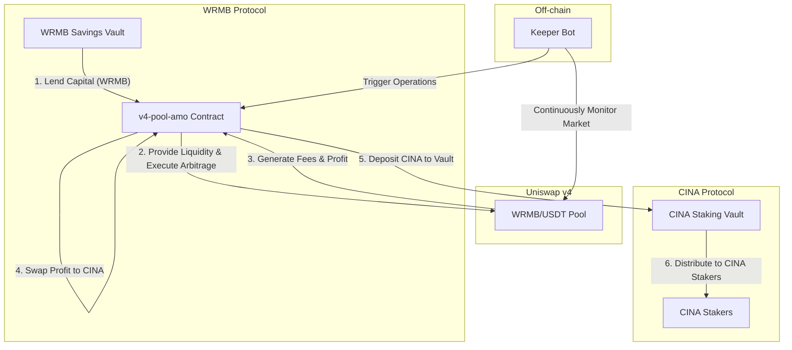

# Uniswap v4 AMO - Product & Strategy Document

## 1. Overview & Positioning

The Uniswap v4 Pool AMO (Algorithmic Market Operations) is a highly automated on-chain asset management module deployed and managed by the CINA Protocol.

**Product Positioning:** It does not directly face ordinary users but is a **protocol-level "Value Capture" engine**. Its core mission is to utilize assets borrowed from the WRMB Protocol to generate profit through active market making and arbitrage on the Uniswap v4 market, and ultimately feed these profits back to CINA Protocol token holders.

It plays the role of "Chief Investment Officer" and "Profit Center" in the entire CINA ecosystem.

## 2. Ecosystem "Flywheel" Model

The essence of this AMO design is that it builds a value growth flywheel spanning three independent protocols.

**Flywheel Operation Flow:**

1.  **Borrow Capital:** The AMO module borrows a sum of initial capital (WRMB tokens) at low cost from the WRMB Protocol's savings vault (`savingsVault`).
2.  **Market Operation:** The AMO combines the borrowed WRMB with some of the protocol's own USDT to provide concentrated liquidity in the WRMB/USDT pool on Uniswap v4.
3.  **Capture Profit:**
    *   **Market Making Yield:** As a liquidity provider, the AMO earns trading fees from all trading pairs in the pool.
    *   **Arbitrage Yield:** When the price in the pool deviates from the external market price, the off-chain Keeper Bot triggers the AMO to execute arbitrage trades, buying low and selling high to capture the price difference profit.
4.  **Value Conversion:** The AMO contract converts its accumulated profits (mostly USDT or WRMB) into CINA tokens on the market periodically or when reaching a certain threshold.
5.  **Profit Distribution:** The converted CINA tokens are deposited directly into the CINA Protocol's staking vault (`StakingCINAVault`).
6.  **Feed Back to Ecosystem:** The staking vault distributes these CINA tokens as Real Yield to all CINA token stakers according to its internal distribution mechanism.

Through this process, the AMO transforms the commercial activity of a neutral trading market (Uniswap v4) into direct value injection for the CINA ecosystem.

## 3. Core Strategies & Roles

### 3.1. Active Liquidity Management Strategy

*   **Concentrated Liquidity:** The AMO does not provide full-range liquidity but concentrates funds in a narrow range near the current market price to maximize capital efficiency and fee revenue.
*   **Dynamic Rebalancing:** Market prices fluctuate constantly. When the price is about to move out of the AMO's liquidity range, the off-chain **Keeper Bot** calls the contract's `rebalance` function to withdraw the old liquidity position and create a new position in the new price range. This ensures the AMO's capital is always "in battle".
*   **Debt Management:** All AMO operations must be conducted above its "Health Line", ensuring its total asset value is far higher than the debt value borrowed from the WRMB Protocol to avoid bad debt risk.

### 3.2. Keeper Bot

*   **Role:** An off-chain automated program, the "eyes" and "hands" of the AMO strategy.
*   **Responsibilities:**
    *   **Monitoring:** Monitors the price, volume, and volatility of the Uniswap v4 pool 24/7.
    *   **Triggering:** When identifying arbitrage opportunities or the need for rebalancing, calculates optimal parameters and calls the `executeArbitrage` or `rebalance` function on the AMO contract, paying Gas fees to execute the operation.
*   **Relationship:** The AMO contract itself is passive; it defines "what can be done", while the Keeper Bot decides "when to do it" and "how exactly to do it".

## 4. Uniswap v4 Hook Incentive Layer

This is a user-facing independent feature **parallel** to the core financial strategy.

*   **Purpose:** Incentivize ordinary users to trade in the WRMB/USDT pool where the AMO is located, thereby increasing trading volume and creating more fee revenue for the AMO.
*   **Implementation:** Implemented through a `WRMBHookUpgradeable.sol` contract.
    *   This "Hook" contract is "attached" to the Uniswap v4 pool.
    *   Every trade or liquidity addition/removal operation in the pool automatically triggers this hook contract.
    *   The hook contract accumulates **Points** for participating user addresses based on preset rules.
*   **Value:** These points can subsequently be used for airdrops, distributing other rewards, or as credentials for participating in other CINA ecosystem activities. It adds a dimension of marketing and user growth without interfering with the AMO's core strategy.
