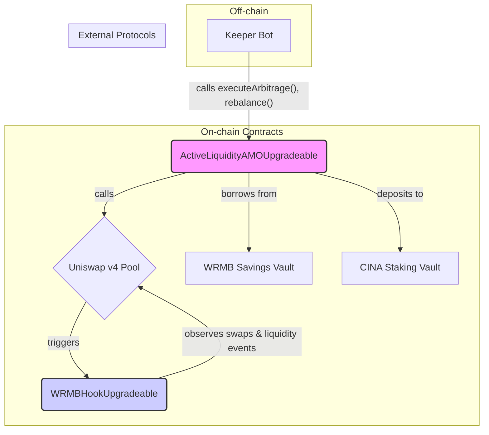

# Uniswap v4 AMO - Technical Architecture Document

## 1. Overview

`v4-pool-amo` is a smart contract system built on the Foundry framework. It implements a complex Algorithmic Market Operations (AMO) module that leverages new features of Uniswap v4 (especially Hooks) and acts as a bridge integrating the resources and value of three protocols: WRMB, Uniswap v4, and CINA.

All core contracts follow the UUPS Upgradeable Proxy pattern (`UUPSUpgradeable`) to ensure future business logic can be flexibly iterated.

## 2. Tech Stack

*   **Development & Testing Framework:** [Foundry](https://book.getfoundry.sh/)
*   **Smart Contract Language:** Solidity (`^0.8.24`)
*   **Core Dependencies:**
    *   **[Solmate](https://github.com/transmissions11/solmate):** For efficient, gas-saving contract base implementations.
    *   **[Foundry Std](https://github.com/foundry-rs/foundry/tree/master/crates/forge/tests/data/project-std):** Foundry's standard library for testing and development.
    *   **[OpenZeppelin Contracts Upgradeable](https://github.com/OpenZeppelin/openzeppelin-contracts-upgradeable):** For implementing upgradeable proxy contracts.
    *   **[Uniswap/v4-core](https://github.com/Uniswap/v4-core):** Uniswap v4 core contracts, including `IPoolManager` interface and Hook related interfaces.

## 3. Core Contracts & Architecture

The system's core is the interaction of three contracts: `ActiveLiquidityAMOUpgradeable` (Brain), `WRMBHookUpgradeable` (Sensor), and `StakingCINAVault` (Vault).

### 3.1. `ActiveLiquidityAMOUpgradeable.sol` - AMO Brain

This is the system's core business logic contract.

*   **Role:** As the executor of the AMO strategy, it holds funds (borrowed and owned) and makes all strategic decisions.
*   **Key State Variables:**
    *   `poolManager`: Uniswap v4 `PoolManager` contract address.
    *   `poolKey`: Identifies the Uniswap v4 pool the AMO is operating on (e.g., WRMB/USDT, 1% fee).
    *   `savingsVault`: Address of the WRMB savings vault, from where the AMO borrows.
    *   `stakingCINAVault`: Address of the CINA staking vault, where the AMO deposits profits.
    *   `debtRatio`: Key risk parameter used to control the AMO's leverage and health status.
*   **Core Functions:**
    *   **`requestWRMB(uint256 amount)`:** Requests to borrow WRMB capital from `savingsVault`.
    *   **`addLiquidity(...)`:** Adds or creates concentrated liquidity positions in the Uniswap v4 pool.
    *   **`rebalance(int24 newTickLower, int24 newTickUpper)`:** Called by Keeper Bot to move liquidity from old price range to new price range.
    *   **`executeArbitrage(...)`:** Called by Keeper Bot to execute trades when arbitrage opportunities are found.
    *   **`convertFeesToCINA()`:** Swaps accumulated trading fees and profits (usually WRMB or USDT) into CINA tokens on the market.
    *   **`distribute()`:** Calls `stakingCINAVault`'s `distributeRewards` function to deposit swapped CINA into the staking vault.

### 3.2. `WRMBHookUpgradeable.sol` - Uniswap v4 Hook

This contract demonstrates ingenious use of Uniswap v4's new features, aiming to implement a user incentive system independent of core financial logic.

*   **Role:** As a "Hook", it is registered to the Uniswap v4 liquidity pool, acting as a passive "sensor" or "observer".
*   **Implementation Principle:**
    *   Uniswap v4 allows triggering an external contract at key points in the pool's lifecycle (e.g., before/after swap, before/after add/remove liquidity). This external contract is the "Hook".
    *   `WRMBHookUpgradeable` implements the `IHook` interface and defines the `getHookPermissions` function to tell the Pool Manager which points it wants to be triggered at.
*   **Core Functions:**
    *   **`_afterSwap(...)`:** Automatically called by Uniswap v4 Pool Manager **after every** trade in the pool. It records the initiator address and transaction amount.
    *   **`_afterAddLiquidity(...)`:** Automatically called **after every** liquidity addition by a user.
    *   **Points System:** Inside these functions, the contract accumulates "Points" for user addresses based on preset logic (e.g., higher volume, more points). These points are stored in a state variable in the contract.
*   **Architectural Advantage:** This design completely decouples **User Incentives** from **Core AMO Strategy**. The AMO contract only cares about its own profitability and risk, while the Hook contract only cares about tracking user behavior. The two do not interfere with each other, making the system more modular and scalable.

### 3.3. `StakingCINAVault.sol` - Profit Destination

*   **Role:** CINA Protocol's staking vault, the final destination for value generated by the AMO.
*   **Function:**
    *   It has a core `distributeRewards(uint256 amount)` function that only allows trusted AMO contract addresses to call.
    *   When the AMO calls this function, the vault receives CINA tokens and distributes them to CINA token stakers according to its internal staking and reward distribution logic.

## 4. Summary

`v4-pool-amo` is a technologically advanced and sophisticated multi-protocol integration module. It not only demonstrates a deep understanding and application of Uniswap v4's new features but, more importantly, builds a powerful, sustainable value capture engine for the CINA ecosystem through a clear on-chain closed loop of "Borrow -> Operate -> Profit -> Feed Back". Its upgradeable design also leaves ample room for future strategy iteration and optimization.
