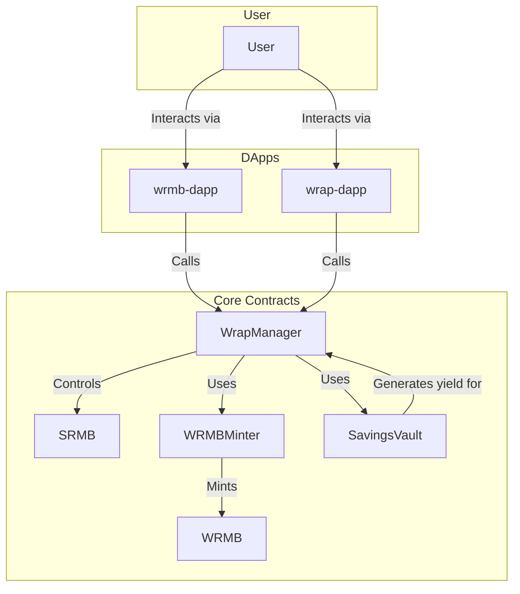

# WRMB Protocol - Technical Architecture Document

## 1. Overview

The WRMB Protocol is a Solidity-based smart contract system. Its core is to implement a value-accumulating savings and yield mechanism. The key to its architectural design is separating token **Liquidity (`WRMB`)** from **Savings Certificates (`sRMB`)**, and driving the entire system through a central coordination contract (`WrapManager`) and a yield engine (`SavingsVault`).

## 2. Core Contracts (`WRMB-protocol-contracts`)

All core business logic is defined in the `WRMB-protocol-contracts` repository.

### 2.1. `WRMB.sol`
*   **Type:** Standard ERC20 Token.
*   **Role:** The protocol's liquidity token, freely tradable on secondary markets.
*   **Key Logic:** Contains a `mint` function, but it is restricted to `onlyMinter`, meaning only the specified `WRMBMinter` contract address can mint new `WRMB` tokens. This controls the source of token inflation.

### 2.2. `SRMB.sol`
*   **Type:** Restricted ERC20 Token.
*   **Role:** The "Entry Ticket" to the savings system.
*   **Key Logic:**
    *   Its `_beforeTokenTransfer` (or similar hook) is overridden to implement `_restrictedTransfer` logic.
    *   This logic only allows the `wrapContract` address (i.e., `WrapManager`) to transfer `sRMB`.
    *   This means users cannot transfer `sRMB` between themselves; they can only obtain or consume `sRMB` by interacting with the `WrapManager` contract.

### 2.3. `WrapManager.sol`
*   **Role:** **Core Coordination Contract**, the direct entry point for most user interactions.
*   **Key Logic:**
    *   **`wrap(uint256 amount)`:**
        1.  Receives user's `WRMB` tokens.
        2.  Calls `WRMBMinter`'s `mintOnWrap` function, which internally calls `SRMB.mint()` to mint an equal amount of `sRMB` for the user.
    *   **`unwrap(uint256 amount)`:**
        1.  Burns user's `sRMB` tokens.
        2.  Transfers an equal amount of `WRMB` tokens back to the user.
    *   **`deposit(uint256 amount)`:** (Related to Savings)
        1.  Receives user's `sRMB`.
        2.  Transfers `sRMB` to `SavingsVault`.
        3.  `SavingsVault` credits the user with a corresponding amount of `sWRMB` shares based on its internal value calculation.
    *   **`withdraw(uint256 shareAmount)`:** (Related to Savings)
        1.  Notifies `SavingsVault` to burn user's `sWRMB` shares.
        2.  `SavingsVault` calculates how much `sRMB` these shares are currently worth and authorizes `WRMBMinter` to mint this portion of `sRMB`.
        3.  `WRMBMinter`'s `mintOnIncrease` function is called to mint new `sRMB` for the user.

### 2.4. `WRMBMinter.sol`
*   **Role:** The sole minter of `WRMB` and `sRMB` tokens, the center of the protocol's monetary policy.
*   **Key Logic:**
    *   It defines the only source of token inflation (mainly `sRMB`).
    *   **`mintOnWrap`:** Called by `WrapManager` during user `wrap` operations to mint `sRMB` 1:1.
    *   **`mintOnIncrease`:** Called when users withdraw yield from `SavingsVault`, used to mint `sRMB` issued due to yield.
    *   **No Rebase:** The logic explicitly shows that token issuance is based on user actions (`wrap` and `withdraw`), and there is **no** automatic Rebase mechanism.

### 2.5. `SavingsVault.sol`
*   **Role:** The protocol's yield engine and treasury.
*   **Key Logic:**
    *   **Asset Management:** Responsible for managing all funds deposited by users.
    *   **Strategy Execution:** Funds held are used to execute various investment strategies to generate yield, e.g., providing them to the `v4-pool-amo` module for market making.
    *   **Value Accounting:** Responsible for calculating the Net Asset Value (NAV) of `sWRMB` shares. When yield is generated, the NAV of `sWRMB` increases.

## 3. Frontend Applications

### 3.1. `wrmb-dapp`
*   **Positioning:** Full-featured main application.
*   **Tech Stack:** Vue.js (Inferred, consistent with other DApps in the ecosystem).
*   **Functional Pages & Contract Interaction:**
    *   **`Wrap.vue`:** Interacts with `WrapManager`'s `wrap` and `unwrap` functions.
    *   **`Savings.vue`:** Interacts with `WrapManager`'s `deposit` and `withdraw` functions, and reads data like `sWRMB` NAV from `SavingsVault` for display.
    *   **`Bonds.vue`:** Interacts with the protocol's bond contracts (not included in the core contracts of this analysis).

### 3.2. `wrap-dapp`
*   **Positioning:** Lightweight, single-function tool.
*   **Tech Stack:** Vue.js (Inferred).
*   **Functional Pages & Contract Interaction:**
    *   Its only page `Home.vue` interacts only with `WrapManager`'s `wrap` and `unwrap` functions, providing a focused, distraction-free swap experience.
