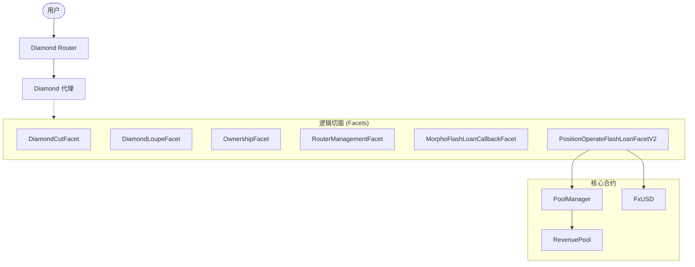

# CINA Protocol V2：技术架构

## 1. 概述
CINA Protocol V2 基于 **EIP-2535 Diamond 标准** 构建，为去中心化稳定币业务提供了一个模块化且可升级的框架。该架构允许协议突破 24KB 的合约大小限制，并支持无缝的功能升级。

## 2. Diamond 架构
协议的核心是 `Diamond` 合约，它充当各种 "Facet"（逻辑实现）的代理。

### 2.1 核心组件
- **Diamond Proxy**: 主入口点，将调用委托给不同的 Facets。
- **Facets**: 独立的逻辑单元（例如用于杠杆操作的 `PositionOperateFlashLoanFacetV2`）。
- **PoolManager**: 管理抵押品池和债务逻辑。
- **FxUSD**: 协议的原生稳定币。

## 3. 仓位管理
V2 协议引入了先进的仓位管理技术，主要通过闪电贷（Flash Loans）提高资金效率。

### 3.1 闪电开仓流程
1. **借入 (Borrow)**: 通过 Morpho Blue 闪电借入抵押品或债务代币。
2. **执行 (Execute)**: 使用借入的资金铸造 fxUSD 或在资产之间进行交换。
3. **偿还 (Repay)**: 在同一笔交易中，利用新创建仓位的资产偿还闪电贷。

## 4. 关键合约与文件
- `contracts/core/PoolManager.sol`: 中央账本和资金池逻辑。
- `contracts/periphery/Diamond.sol`: EIP-2535 代理实现。
- `contracts/common/EIP2535/`: Diamond 标准切面的实现。
- `contracts/periphery/facets/PositionOperateFlashLoanFacetV2.sol`: 启用闪电贷的仓位操作逻辑。

## 5. 部署结构
部署分为两部分：
1. **核心协议 (Core Protocol)**: 基础稳定币逻辑。
2. **Diamond Router**: 用于高级交易功能的外围合约。
