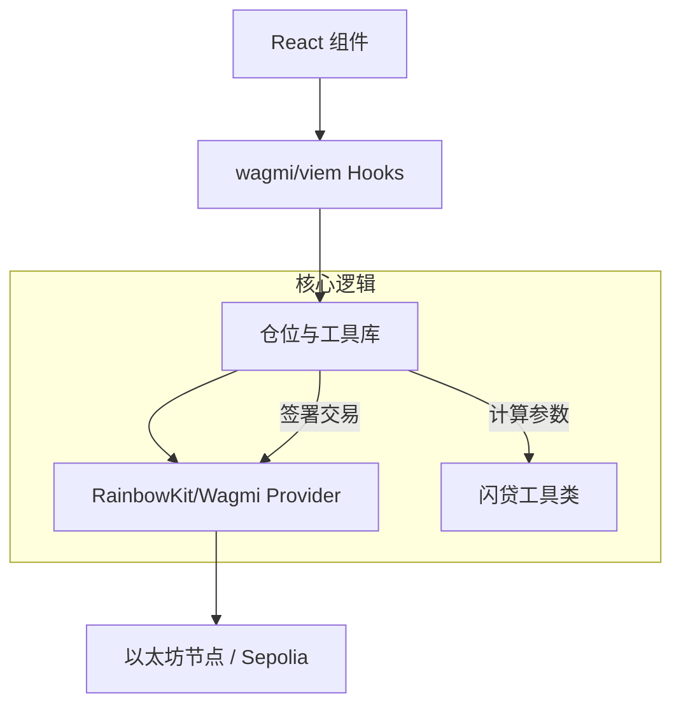

# CINA Trade：技术架构

## 1. 技术栈
CINA Trade 使用现代前端技术栈构建，确保了速度、安全性和开发效率：
- **框架**: [Next.js](https://nextjs.org/) (React)
- **样式**: [Tailwind CSS](https://tailwindcss.com/)
- **Web3 库**: [wagmi](https://wagmi.sh/) & [viem](https://viem.sh/)
- **钱包 UI**: [RainbowKit](https://www.rainbowkit.com/)
- **状态管理**: React Context & Hooks

## 2. 核心逻辑实现
应用程序逻辑的核心在于高效的合约交互和鲁棒的闪电贷操作参数计算。

### 2.1 仓位管理 (`src/lib/position.ts`)
处理开启和关闭仓位的高级编排。它直接与 `DiamondRouter` 的切面（Facets）进行交互：
- `openPositionFlashLoan`: 准备并发送启用闪电贷开仓的交易。
- `closePositionFlashLoan`: 管理杠杆仓位的原子化退出。

### 2.2 闪贷工具类 (`src/lib/flashloan-utils.ts`)
包含杠杆操作的数学逻辑：
- **借贷计算**: `抵押品金额 * (杠杆倍数 - 1)`。
- **Hook 数据编码**: 编码 `DiamondRouter` 回调所需的复杂 bytes 数据。
- **滑点强制执行**: 根据用户定义的公差计算 `minOut`。

## 3. 架构图

## 4. 与 CINA Protocol 的集成
CINA Trade 充当 `CINA-protocol` 的主要前端实现。它专门针对 V2 中实现的 **Diamond Router**，利用其模块化 Facets 提供“一键式”杠杆交易体验。

## 5. 部署与测试
- **开发**: `npm run dev`
- **构建**: `npm run build`
- **测试**: 使用 [Vitest](https://vitest.dev/) 对工具函数和逻辑验证进行管理。
