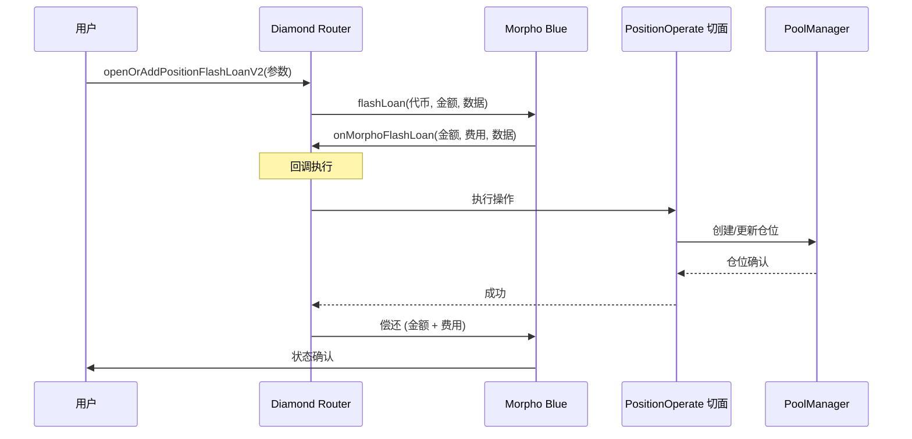

# 闪电开仓：技术指南

## 1. 简介
闪电开仓（Flash Open Position）机制允许用户通过利用闪电贷，在单笔交易中开启杠杆仓位。在 CINA Protocol V2 中，这是通过集成在 Diamond Router 中的 **Morpho Blue** 闪电贷实现的。

## 2. 机制概述
核心思想是预先借入所需的资金，建立仓位，然后利用铸造的 `fxUSD` 或抵押品来满足闪电贷的偿还要求。

### 2.1 工作流程


## 3. 集成细节
### 3.1 合约方法
主要入口点是 `DiamondRouter` 上的 `openOrAddPositionFlashLoanV2`。

```solidity
function openOrAddPositionFlashLoanV2(
    ConvertInParams calldata convertInParams,
    address pool,
    uint256 positionId,
    uint256 borrowAmount,
    bytes calldata hookData
) external payable returns (uint256 newPositionId);
```

### 3.2 关键参数
- `convertInParams`: 关于初始抵押品存款和所需 DEX 交换的信息。
- `borrowAmount`: 通过闪电贷借入的金额，以达到目标杠杆。
- `hookData`: 编码的风险参数和回调指令。

## 4. 集成示例 (TypeScript/viem)
用户可以使用以下模式与此功能交互：

```typescript
const tx = await writeContract(config, {
  address: DIAMOND_ROUTER_ADDRESS,
  abi: POSITION_FACET_ABI,
  functionName: 'openOrAddPositionFlashLoanV2',
  args: [
    convertInParams, // 抵押品和交换信息
    POOL_ADDRESS,    // 目标 FxPool
    0n,              // 0 表示新仓位
    borrowAmount,    // 计算出的闪电贷金额
    hookData         // 编码的回调数据
  ],
});
```

## 5. 安全与风险管理
- **滑点保护**: `ConvertInParams` 包含 `minOut`，以防止 DEX 价格波动。
- **最大债务比例**: `hookData` 强制执行最大债务比例，以防止立即清算。
- **原子性执行**: 由于使用了闪电贷，整个操作是原子性的；如果任何步骤失败，交易将回滚，不会损失资金（ gas 费除外）。
