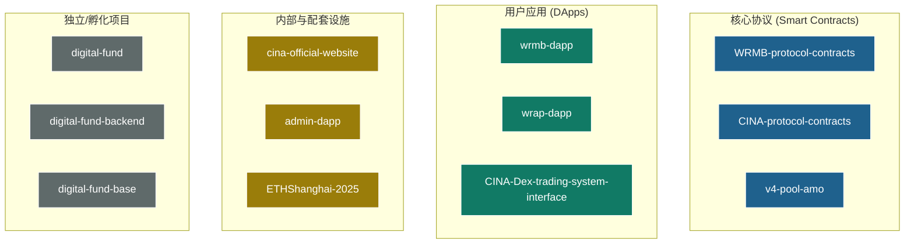
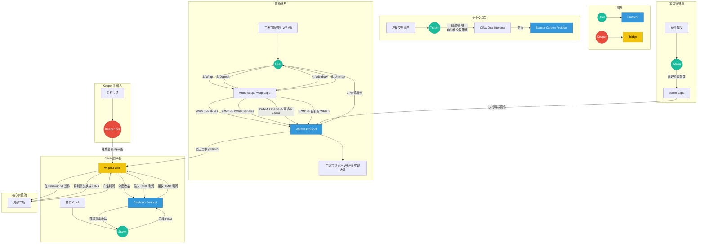

# CINA 生态系统究极产品手册

## 1. 宏观愿景：三位一体的 DeFi 乐高

CINA 生态系统并非一个单一协议，而是一个由三大独立协议、多个 DApp 应用和基础设施共同组成的、可相互组合的复杂 DeFi 生态。其设计的核心思想是通过不同协议的专业化分工与协作，构建一个能够自我强化、捕获价值并反哺生态的“价值飞轮”。

**三大核心协议：**

1.  **WRMB 储蓄与收益协议:** 生态的**资本与收益层**。负责汇集用户资金，并通过投资策略产生真实收益。
2.  **CINA/f(x) 稳定币协议:** 生态的**治理与资产层**。负责发行稳定币资产（`fxUSD`），并以其治理代币 `CINA` 作为生态价值的最终捕获者。
3.  **Bancor Carbon 交易协议:** 生态的**专业交易层**。负责提供先进的、自动化的链上交易策略功能，吸引专业交易用户。

## 2. 项目结构全景

CINA 生态由 12 个代码仓库组成，各自扮演不同角色：

## 3. 多角色用户交互全景流程图

下图描绘了生态系统中主要参与者的完整交互路径和价值流动。

## 4. 各协议产品深度解析

### 4.1. WRMB 储蓄与收益协议

*   **一句话定位:** 生态的“储蓄银行”，通过独特的代币机制为用户提供安全、可持续的真实收益。
*   **核心玩法:**
    1.  **进入:** 用户将市场上自由流通的 `WRMB`，通过官方 DApp（`wrmb-dapp` 或 `wrap-dapp`）1:1“封装”成不可转让的 `sRMB`。
    2.  **储蓄:** 将 `sRMB` 存入协议的“金库”(`SavingsVault`)，换取金库的份额凭证 `sWRMB`。
    3.  **增值:** `SavingsVault` 将资金用于投资（例如，借给 `v4-pool-amo`），产生的利润使 `sWRMB` 份额的净值（NAV）不断增长。
    4.  **收获:** 用户将增值后的 `sWRMB` 份额赎回，会得到比当初存入时**数量更多**的 `sRMB`。
    5.  **退出:** 将 `sRMB` 1:1“解封装”成 `WRMB`，即可在二级市场卖出，实现最终盈利。
*   **相关应用:**
    *   `wrmb-dapp`: 全功能主应用，提供储蓄、债券、封装等所有功能。
    *   `wrap-dapp`: 轻量级工具，仅提供封装/解封装功能。
    *   `admin-dapp`: 协议管理员的后台，用于管理利率、投资策略等。

### 4.2. CINA/f(x) 稳定币协议

*   **一句话定位:** 生态的“中央银行”和“治理议会”，负责发行核心资产并捕获生态价值。
*   **核心产品:**
    *   **`fxUSD` 稳定币:** 基于 f(x) Protocol 的先进架构，通过超额抵押各类资产（包括 RWA）来铸造，其稳定性由 `PegKeeper` 等一系列复杂机制保障。
    *   **`CINA` 治理代币:** CINA 代币的持有者和质押者是生态的最终所有者。生态中的各项利润（特别是来自 `v4-pool-amo` 的利润）最终都会汇集于此，以真实收益的形式分配给 CINA 质押者。
*   **相关应用:**
    *   `ETHShanghai-2025`: 一个功能演示，展示了如何利用该协议和闪电贷实现复杂的杠杆交易，证明了其强大的可组合性。

### 4.3. Bancor Carbon 交易协议 (通过 `CINA-Dex-trading-system-interface`)

*   **一句话定位:** 生态的“专业交易终端”，服务于高级交易用户。
*   **核心玩法:** 它并非一个简单的币币兑换（Swap）平台，而是允许用户创建**链上自动化交易策略**。
    *   **区间策略:** 用户可以设置一个买入价格区间和一个卖出价格区间（例如，在 $1800-$1900 买 ETH，在 $2500-$2600 卖 ETH）。
    *   **循环策略:** 策略可以自动循环执行，卖出获得的资金会自动成为买入的弹药，实现持续的“高抛低吸”。
*   **生态角色:** 虽然底层是 Bancor Carbon 协议，但 CINA 将其作为自身生态的一部分进行包装和推广，以此吸引和留存专业交易用户，丰富生态的多样性。

## 5. 总结：一个设计精巧的价值闭环

CINA 生态系统的产品设计展现了极高的水准。它并非简单地将功能堆砌，而是通过 `v4-pool-amo` 这个关键的价值桥梁，将 **WRMB 协议的资本沉淀能力**，巧妙地转化为了 **CINA 协议的价值支撑和真实收益来源**，形成了一个可持续的、正向的经济飞轮。同时，通过引入 Carbon 交易平台，进一步拓展了其用户画像和生态边界。
