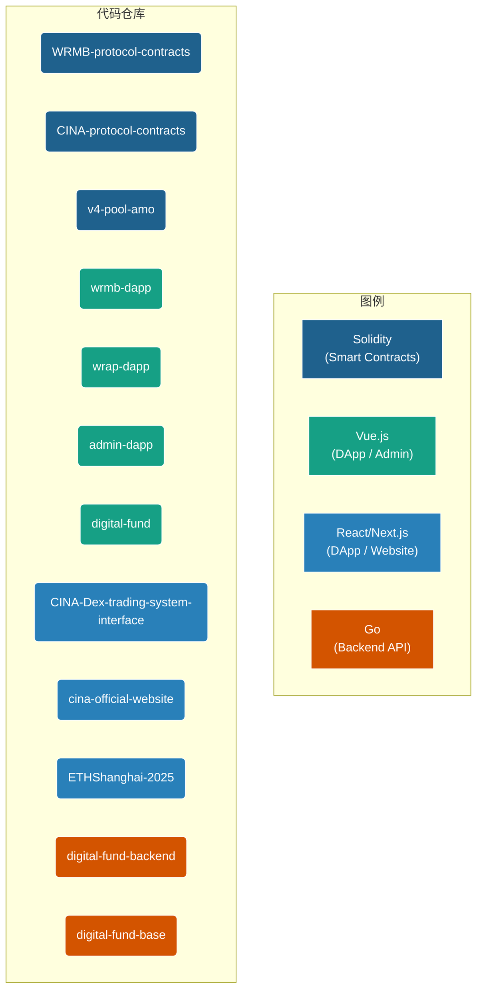

# CINA 生态系统统一技术文档

## 1. 宏观技术架构：微服务式的多仓库项目群

CINA 生态系统在技术上遵循“微服务”和“关注点分离”的核心思想，由一个包含 12 个独立代码仓库的项目群构成。每个仓库都有明确的职责和最适合其场景的技术栈，它们之间通过定义清晰的链上智能合约接口和链下 API 进行通信。

这种架构模式虽然初看复杂，但带来了极高的**模块化、可维护性和技术选型灵活性**。

## 2. 项目代码结构图

下图直观地展示了项目根目录下的所有代码仓库及其核心技术定位。

## 3. 技术栈详解与选型分析

### 3.1. 智能合约层

*   **语言:** Solidity (`^0.8.x`)
*   **核心框架:**
    *   **Foundry & Hardhat (混合使用):** 这是整个项目合约开发的标准模式。
        *   **Foundry:** 因其卓越的性能和强大的模糊测试能力，被用于 `v4-pool-amo` 等需要高强度数学计算和逻辑验证的核心模块。
        *   **Hardhat:** 因其成熟的插件生态、强大的脚本能力和与前端工具链（如 TypeChain）的良好集成，被用于 `CINA-protocol-contracts` 和 `WRMB-protocol-contracts` 等大型、复杂的协议主体。
*   **关键设计模式:**
    *   **可升级性 (UUPS):** `v4-pool-amo` 等核心业务合约均采用 UUPS 可升级代理模式，确保了未来可以安全、低成本地迭代逻辑。
    *   **模块化 (EIP-2535 Diamond Standard):** `CINA-protocol-contracts` 采用了钻石标准，将协议的不同功能（如头寸管理、闪电贷）解耦到独立的“切面（Facet）”合约中，实现了极高的模块化和扩展性。这是 `ETHShanghai-2025` 能够以一个新增 Facet 的形式无缝集成闪电贷功能的技术基础。
    *   **权限控制:** 广泛使用 OpenZeppelin 的 `Ownable` 或 `AccessControl` 模式，对特权函数（如修改费率、暂停合约）进行严格的权限管理。

### 3.2. 前端应用层

前端技术选型呈现出清晰的“因地制宜”的特点：

*   **Vue.js 3 生态:**
    *   **技术栈:** Vue 3 (Composition API), Vite, Vue Router, Pinia, Ethers.js。
    *   **应用场景:** 主要用于**内部管理工具**和**功能相对聚焦的 DApp**，如 `admin-dapp`, `wrmb-dapp`, `digital-fund`。
    *   **选型理由:** Vue 3 的开发体验流畅，心智负担较低，配合 Pinia 进行状态管理非常直观。对于功能明确、交互路径清晰的管理后台和工具类 DApp 而言，这是实现快速开发和稳定交付的绝佳选择。

*   **React/Next.js 生态:**
    *   **技术栈:** React 18, Next.js (App Router), TanStack (Router/Query), Wagmi。
    *   **应用场景:** 用于**面向公众的官网**和**功能极其复杂的专业级 DApp**，如 `cina-official-website` 和 `CINA-Dex-trading-system-interface`。
    *   **选型理由:**
        *   **SEO & 性能:** Next.js 的静态站点生成（SSG）和服务器端渲染（SSR）能力是官网 (`cina-official-website`) 的不二之选。
        *   **复杂状态管理:** 对于 `CINA-Dex-trading-system-interface` 这种具有复杂表单、实时数据同步和大量异步请求的专业应用，React 生态中的 TanStack Query (React Query) 提供了无与伦比的服务端状态管理能力。
        *   **Web3 Hooks:** Wagmi 提供了完善、可靠的 React Hooks，极大地简化了与区块链的交互，是目前 React Web3 开发的最佳实践。

### 3.3. 后端服务层

*   **技术栈:** Go, Gin (Web 框架), GORM (ORM), MySQL。
*   **应用场景:** 用于处理需要链下数据库支持的业务，如 `digital-fund-backend` (NFT 市场 API)。
*   **架构模式:**
    *   **分层架构:** 采用了经典的 `api` -> `service` -> `dao` (Data Access Object) 的分层设计，实现了逻辑与数据的高度解耦。
    *   **共享基础库:** 通过 `digital-fund-base` 仓库来共享数据库模型、工具函数和通用配置，提高了代码的复用性和一致性。

## 4. 总结：现代化、模块化、实用主义

CINA 生态系统的整体技术架构是现代化、模块化和实用主义的典范。它没有拘泥于某一种特定的技术栈，而是为生态系统中的每一个不同组件都选择了当前场景下的最优解。

*   **合约层**拥抱了最新的行业标准，保证了安全、高效和可扩展。
*   **前端层**根据应用的目标用户和复杂度，在 Vue 和 React 两大生态中做出了明智的选择。
*   **协议间的交互**以链上接口为核心，清晰透明，最大化了去信任。

这种务实的、面向未来的技术架构，为 CINA 生态系统的长期稳定发展和未来新功能的不断涌现，奠定了坚实的基础。
