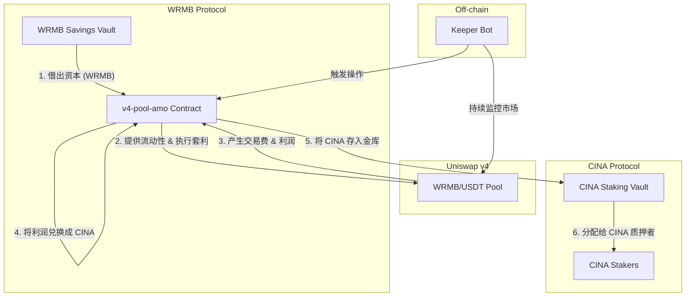

# Uniswap v4 AMO - 产品与策略文档

## 1. 概述与定位

Uniswap v4 Pool AMO (算法市场操作) 是一个由 CINA 协议部署和管理的、高度自动化的链上资产管理模块。

**产品定位:** 它不直接面向普通用户，而是一个**协议层面的“价值捕获”引擎**。其核心使命是利用从 WRMB 协议中借贷的资产，在 Uniswap v4 市场上通过主动做市和套利来产生利润，并将这些利润最终反哺给 CINA 协议的代币持有者。

它在整个 CINA 生态系统中扮演着“首席投资官”和“利润中心”的角色。

## 2. 生态系统“飞轮”模型

这个 AMO 的设计精髓在于它构建了一个跨越三个独立协议的价值增长飞轮。

**飞轮运转流程:**

1.  **借入资本:** AMO 模块从 WRMB 协议的存款金库 (`savingsVault`) 中，以低成本借入一笔初始资本（WRMB 代币）。
2.  **市场运作:** AMO 将借来的 WRMB 与协议自有的部分 USDT 组合，在 Uniswap v4 的 WRMB/USDT 池中提供集中的流动性。
3.  **捕获利润:**
    *   **做市收益:** 作为流动性提供者，AMO 会赚取该池中所有交易对的交易手续费。
    *   **套利收益:** 当池内价格与外部市场价格出现偏差时，链下 Keeper Bot 会触发 AMO 执行套利交易，低买高卖，捕获价差利润。
4.  **价值转换:** AMO 合约会定期或在达到一定阈值时，将其累积的利润（主要是 USDT 或 WRMB）在市场上兑换成 CINA 代币。
5.  **利润分配:** 兑换来的 CINA 代币被直接存入 CINA 协议的质押金库 (`StakingCINAVault`)。
6.  **反哺生态:** 质押金库根据其内部分配机制，将这些 CINA 代币作为真实收益（Real Yield）分配给所有 CINA 代币的质押者。

通过这个流程，AMO 将一个中立交易市场（Uniswap v4）的商业活动，转化为了对 CINA 生态系统的直接价值注入。

## 3. 核心策略与角色

### 3.1. 主动流动性管理策略

*   **集中流动性:** AMO 并非提供全范围的流动性，而是将资金集中在当前市场价格附近的一个狭窄范围内，以最大化资金效率和费用收益。
*   **动态再平衡:** 市场价格会不断波动。当价格即将移出 AMO 的流动性范围时，链下的 **Keeper Bot** 会调用合约的 `rebalance` 函数，撤出旧的流动性头寸，并在新的价格范围内创建新的头寸。这确保了 AMO 的资本始终在“战斗”。
*   **债务管理:** AMO 的所有操作都必须在其“健康线”之上进行，即确保其总资产价值远高于从 WRMB 协议借入的债务价值，以避免坏账风险。

### 3.2. Keeper Bot (守护者机器人)

*   **角色:** 一个链下的自动化程序，是 AMO 策略的“眼睛”和“手”。
*   **职责:**
    *   **监控:** 7x24 小时监控 Uniswap v4 池的价格、交易量和波动性。
    *   **触发:** 在识别到套利机会或需要进行再平衡时，计算最优参数并调用 AMO 合约上的 `executeArbitrage` 或 `rebalance` 函数，支付 Gas 费来执行操作。
*   **关系:** AMO 合约本身是被动的，它定义了“能做什么”，而 Keeper Bot 则决定了“什么时候做”和“具体怎么做”。

## 4. Uniswap v4 Hook 激励层

这是一个与核心金融策略**并行**的、面向用户的独立功能。

*   **目的:** 激励普通用户在 AMO 所在的 WRMB/USDT 池中进行交易，从而增加交易量，为 AMO 创造更多的手续费收入。
*   **实现:** 通过一个 `WRMBHookUpgradeable.sol` 合约实现。
    *   这个“钩子”合约会“挂”在 Uniswap v4 的池子上。
    *   池中的每一笔交易或流动性添加/移除操作，都会自动触发这个钩子合约。
    *   钩子合约根据预设的规则，为参与交易的用户地址**累加积分 (Points)**。
*   **价值:** 这些积分后续可用于空投、分配其他奖励或作为参与 CINA 生态其他活动的凭证。它在不干扰 AMO 核心策略的前提下，增加了一个营销和用户增长的维度。
