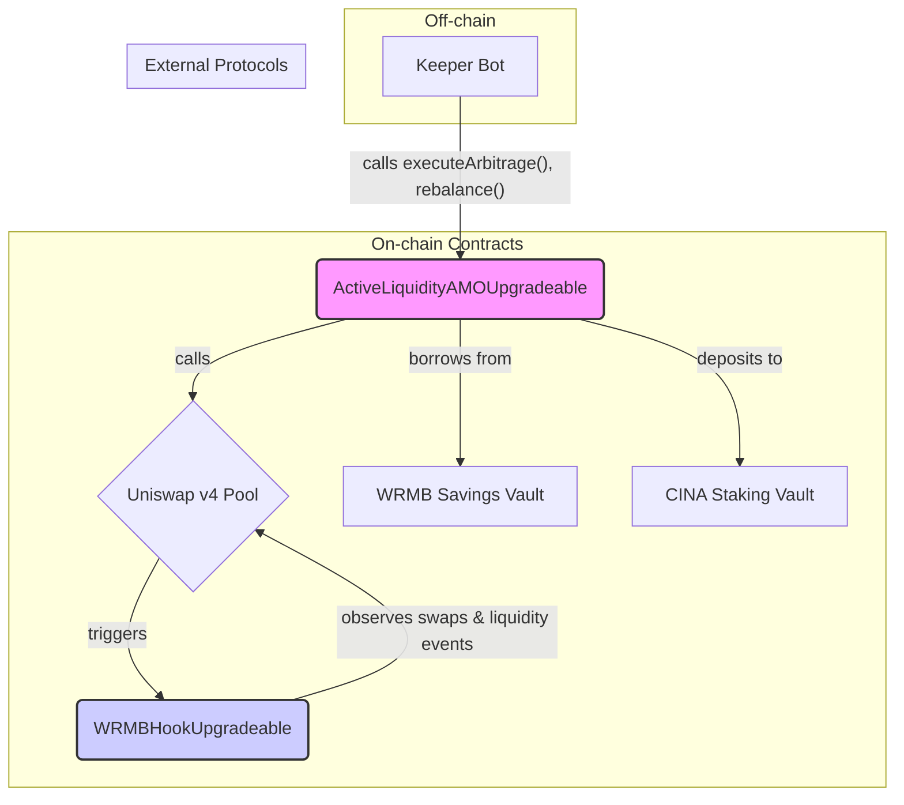

# Uniswap v4 AMO - 技术架构文档

## 1. 概述

`v4-pool-amo` 是一个基于 Foundry 框架构建的智能合约系统。它实现了一个复杂的算法市场操作（AMO）模块，该模块利用了 Uniswap v4 的新特性（特别是 Hooks），并作为一个桥梁，整合了 WRMB、Uniswap v4 和 CINA 三个协议的资源与价值。

所有核心合约都遵循 UUPS 可升级代理模式（`UUPSUpgradeable`），以确保未来的业务逻辑可以灵活迭代。

## 2. 技术栈

*   **开发与测试框架:** [Foundry](https://book.getfoundry.sh/)
*   **智能合约语言:** Solidity (`^0.8.24`)
*   **核心依赖:**
    *   **[Solmate](https://github.com/transmissions11/solmate):** 用于高效、节省 Gas 的合约基础实现。
    *   **[Foundry Std](https://github.com/foundry-rs/foundry/tree/master/crates/forge/tests/data/project-std):** Foundry 的标准库，用于测试和开发。
    *   **[OpenZeppelin Contracts Upgradeable](https://github.com/OpenZeppelin/openzeppelin-contracts-upgradeable):** 用于实现可升级代理合约。
    *   **[Uniswap/v4-core](https://github.com/Uniswap/v4-core):** Uniswap v4 的核心合约，包括 `IPoolManager` 接口和 Hook 相关接口。

## 3. 核心合约与架构

系统的核心是三个合约的交互：`ActiveLiquidityAMOUpgradeable`（大脑）、`WRMBHookUpgradeable`（传感器）和 `StakingCINAVault`（金库）。

### 3.1. `ActiveLiquidityAMOUpgradeable.sol` - AMO 大脑

这是系统的核心业务逻辑合约。

*   **角色:** 作为 AMO 策略的执行者，它拥有资金（借来的和自有的），并做出所有战略决策。
*   **关键状态变量:**
    *   `poolManager`: Uniswap v4 的 `PoolManager` 合约地址。
    *   `poolKey`: 标识 AMO 正在操作的 Uniswap v4 池（例如，WRMB/USDT, 1% fee）。
    *   `savingsVault`: WRMB 存款金库的地址，AMO 从此处借款。
    *   `stakingCINAVault`: CINA 质押金库的地址，AMO 将利润存入此处。
    *   `debtRatio`: 关键的风险参数，用于控制 AMO 的杠杆和健康状况。
*   **核心函数:**
    *   **`requestWRMB(uint256 amount)`:** 向 `savingsVault` 请求借入 WRMB 资本。
    *   **`addLiquidity(...)`:** 在 Uniswap v4 池中添加或创建集中流动性头寸。
    *   **`rebalance(int24 newTickLower, int24 newTickUpper)`:** 由 Keeper Bot 调用，用于将流动性从旧的价格区间移动到新的价格区间。
    *   **`executeArbitrage(...)`:** 由 Keeper Bot 调用，用于在发现套利机会时执行交易。
    *   **`convertFeesToCINA()`:** 将积累的交易费和利润（通常是 WRMB 或 USDT）在市场上兑换成 CINA 代币。
    *   **`distribute()`:** 调用 `stakingCINAVault` 的 `distributeRewards` 函数，将兑换来的 CINA 存入质押金库。

### 3.2. `WRMBHookUpgradeable.sol` - Uniswap v4 钩子

这个合约展示了对 Uniswap v4 新特性的精巧利用，其目的是实现一个独立于核心金融逻辑的用户激励系统。

*   **角色:** 作为一个“钩子”，它被注册到 Uniswap v4 的流动性池中，充当一个被动的“传感器”或“观察者”。
*   **实现原理:**
    *   Uniswap v4 允许在池子生命周期的关键节点（如交易前/后，添加/移除流动性前/后）触发一个外部合约，这个外部合约就是“钩子”。
    *   `WRMBHookUpgradeable` 实现了 `IHook` 接口，并定义了 `getHookPermissions` 函数来告诉 Pool Manager 它希望在哪些节点被触发。
*   **核心函数:**
    *   **`_afterSwap(...)`:** 在池中**每次**有交易发生**后**，这个函数会被 Uniswap v4 的 Pool Manager 自动调用。它会记录下交易发起者的地址和交易金额。
    *   **`_afterAddLiquidity(...)`:** 在**每次**有用户添加流动性**后**，这个函数会被自动调用。
    *   **积分系统:** 在这些函数内部，合约会根据预设的逻辑（例如，交易量越大，积分越多）为用户的地址累加“积分”（Points）。这些积分存储在该合约的某个状态变量中。
*   **架构优势:** 这种设计将**用户激励**与**核心 AMO 策略**完全解耦。AMO 合约只关心自身的盈利和风险，而 Hook 合约只关心追踪用户行为。两者互不干扰，使得系统更加模块化和可扩展。

### 3.3. `StakingCINAVault.sol` - 利润终点

*   **角色:** CINA 协议的质押金库，是 AMO 产生的价值的最终归宿。
*   **功能:**
    *   它有一个核心的 `distributeRewards(uint256 amount)` 函数，只允许受信任的 AMO 合约地址调用。
    *   当 AMO 调用此函数时，金库会收到 CINA 代币，并根据其内部的质押和奖励分配逻辑，将其分配给 CINA 代币的质押者。

## 4. 总结

`v4-pool-amo` 是一个技术先进、设计精巧的多协议集成模块。它不仅展示了对 Uniswap v4 新特性的深刻理解和应用，更重要的是，它通过一个清晰的“借贷 -> 运营 -> 盈利 -> 反哺”的链上闭环，为 CINA 生态系统构建了一个强大的、可持续的价值捕获引擎。其可升级的设计也为未来的策略迭代和优化留下了充足的空间。
